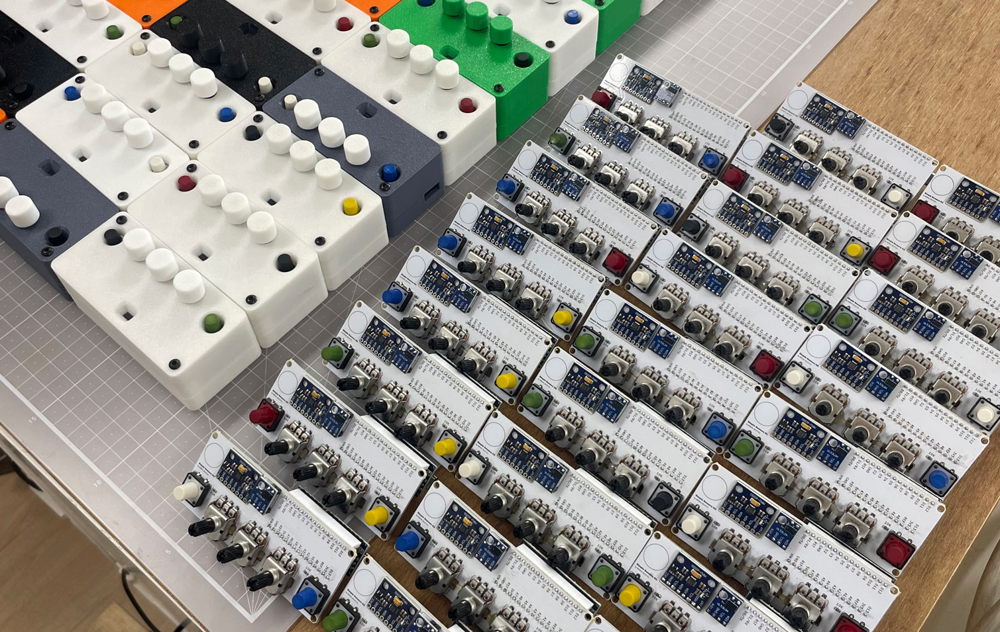
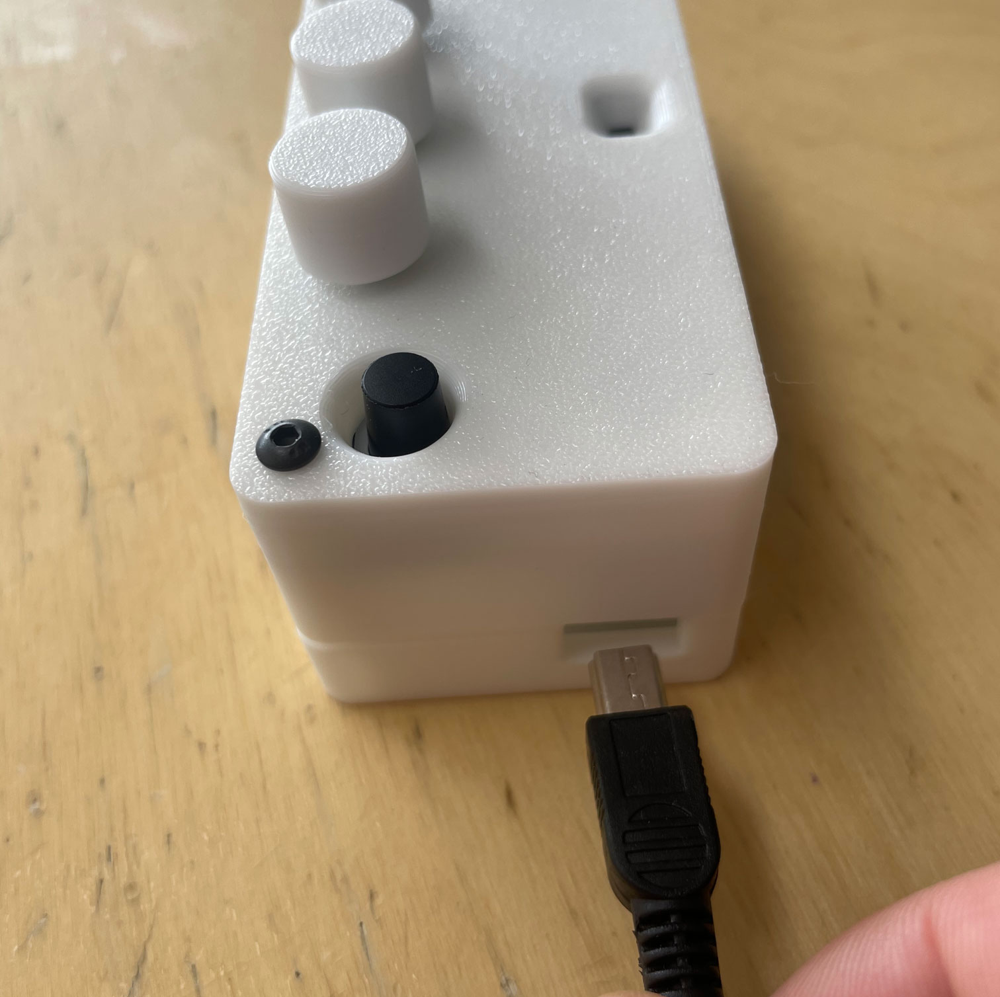
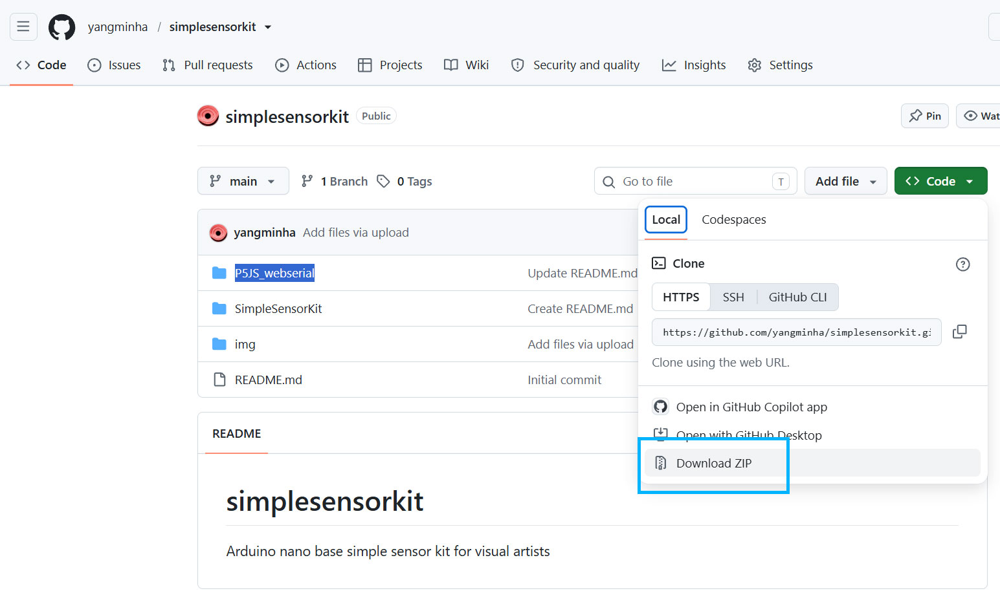
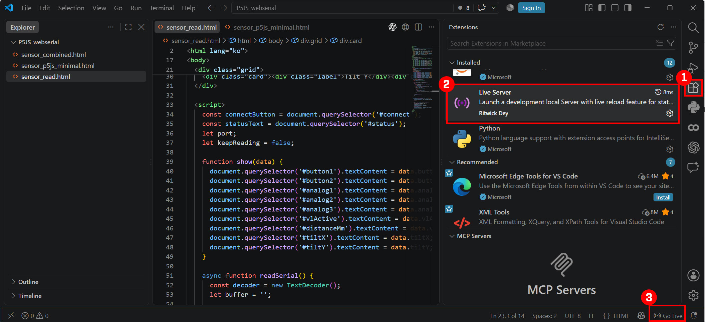
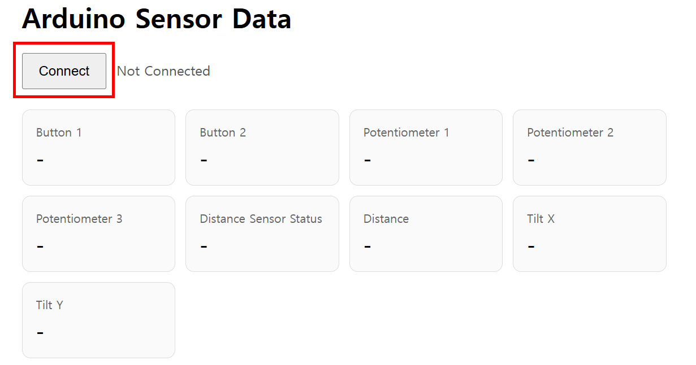
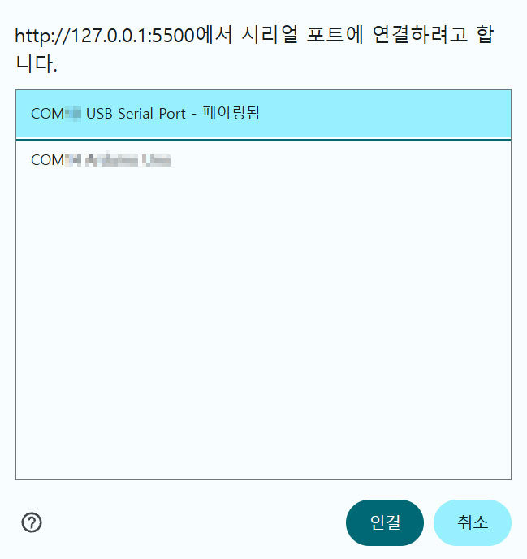
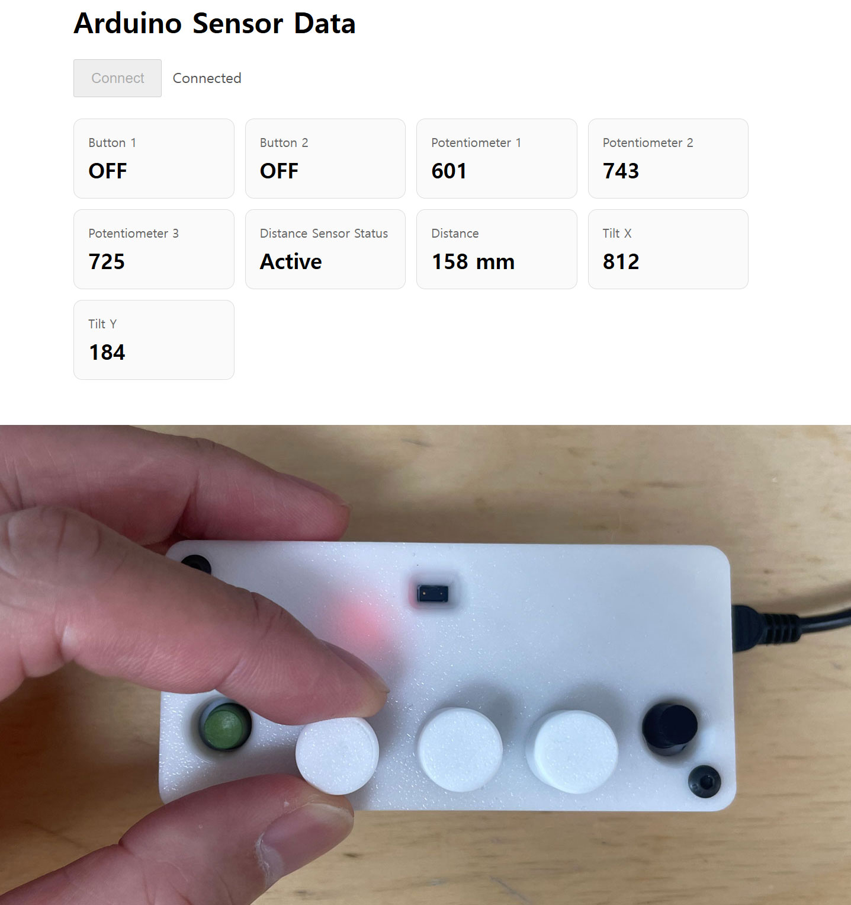

# Simple Sensor Kit
  - Simple Sensor Kit은 아두이노 나노 기반으로 제작된 센서킷입니다.
  - 거리센서와 자이로센서, 그리고 가변저항과 버튼으로 이루어진 조합이며,
  - 2026년 2학기 시립대학교 디자인학과 수업과 외부 워크숍을 위해 제작되었습니다.
  - The Simple Sensor Kit is an Arduino Nano-based sensor kit.
  - It combines a distance sensor, a gyroscope sensor, potentiometers, and buttons.
  - It was developed for classes in the Department of Design at the University of Seoul and for external workshops during the second semester of 2026.

## 사용 방법 (How to Use)
-------------
 - 제공되는 센서킷과 케이블을 컴퓨터에 연결하면 자동으로 설치됩니다.
 - 맥북을 사용하고 있거나 USB-C만 가진 컴퓨터를 쓰고 있다면 반드시 USB 멀티허브와 같은 변환기를 사용해주세요.
 - Connect the provided sensor kit to your computer using the supplied cable. The device should be installed automatically.
 - If you are using a MacBook or a computer that only has USB-C ports, please use a compatible adapter or USB hub.

### 1. 센서킷 준비 (Prepare the Sensor Kit)
 - 센서킷은 아래와 같은 모양입니다.
 - The sensor kit looks like the image below.
 </img> 

### 2. 센서킷과 케이블 연결 (Connect the Sensor Kit Using the Cable)
 - 케이블은 usb mini를 사용하고 있습니다. 아래와 같이 결합하고, 컴퓨터에 연결합니다.
 - The sensor kit uses a USB Mini cable. Connect the cable to the sensor kit as shown below, and then connect it to your computer.
 - 맥북을 사용하고 있거나 USB-C만 가진 컴퓨터를 쓰고 있다면 반드시 USB 멀티허브와 같은 변환기를 사용해주세요.
 - If you are using a MacBook or a computer that only has USB-C ports, please use a compatible adapter or USB hub.
 </img> 

### 3. P5JS_webserial 디렉토리의 소스를 받아주세요. (Download the Files from the P5JS_webserial Directory)
 - https://github.com/yangminha/simplesensorkit 의 P5JS_webserial 디렉토리를 받아주세요.
 - 리파지토리 중앙부 우측에 있는 Code 를 누르면 Download Zip 버튼이 있으니 그걸 눌러서 통째로 받아도 됩니다.
 - Download the P5JS_webserial directory from the following GitHub repository:
 - https://github.com/yangminha/simplesensorkit
 - Alternatively, click the Code button near the upper-right area of the repository page, and then select Download ZIP to download the entire repository.
 </img> 

### 4. Visual Studio Code를 사용해서 다운받은 디렉토리를 열어주세요. (Open the Downloaded Directory in Visual Studio Code)
 - Visual Studio Code를 사용해서 다운받은 디렉토리를 열어주세요.
 - live Server를 이용해 sensor_read.html 파일을 실행합니다. 아래 그림의 3번 버튼을 눌러 실행하면 됩니다.
 - 만약 3번 버튼이 안보인다면 Live Server가 없는 것이니 1번 버튼을 누르고, live server를 검색해 설치주세요
 - Open the downloaded directory in Visual Studio Code.
 - Use the Live Server extension to run the sensor_read.html file. Click button 3 in the image below to launch it.
 - If button 3 is not visible, the Live Server extension may not be installed. Click button 1, search for Live Server, and install it.
   
 </img> 

 - 이제 serial을 연결해주세요.
 - Now, connect to the serial port.

 </img> 

 - serial 연결할 수 있는 포트는 여러 개가 나올 수 있어요. 연결이 되는 녀석을 선택하면 됩니다.
 - Multiple serial ports may appear in the list. Select the port that successfully connects to the sensor kit.
   
 </img> 

 - 연결이 되었다면 이제 센서킷을 돌려 작동을 확인해주세요.
 - Once connected, rotate or move the sensor kit and operate its controls to verify that it is working correctly.
   
 </img> 

### 5. sensor_p5js_minimal.html 파일도 동일한 형식으로 연결하고 실행할 수 있습니다. (You can connect and run the sensor_p5js_minimal.html file by following the same procedure.)

